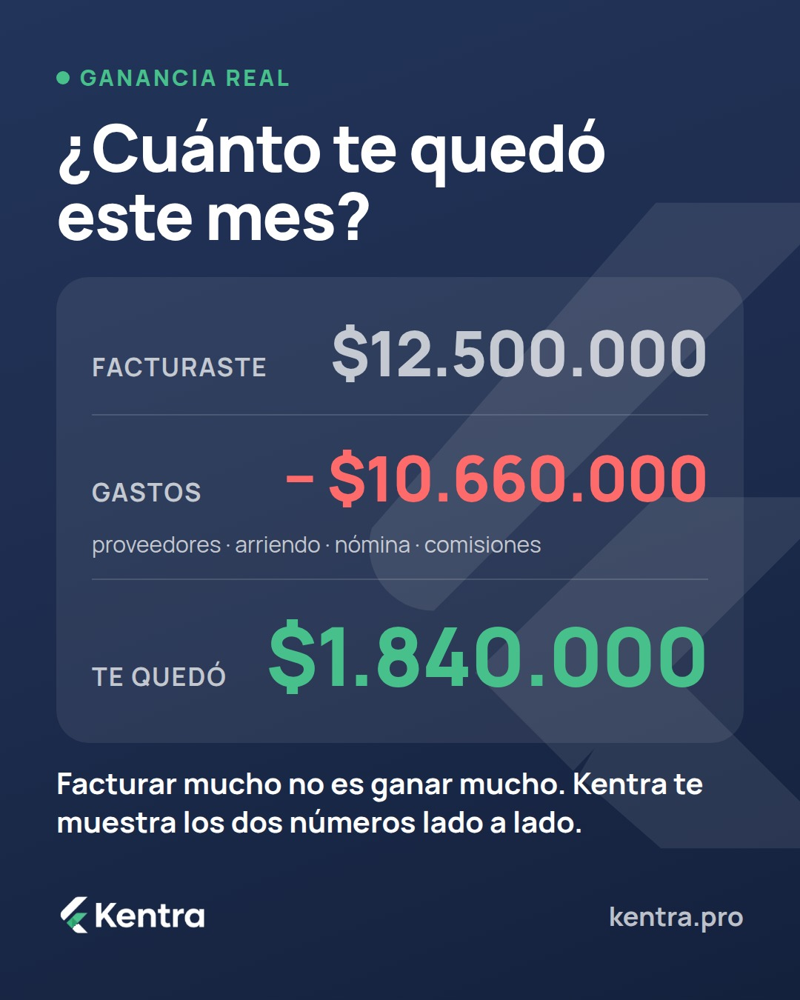
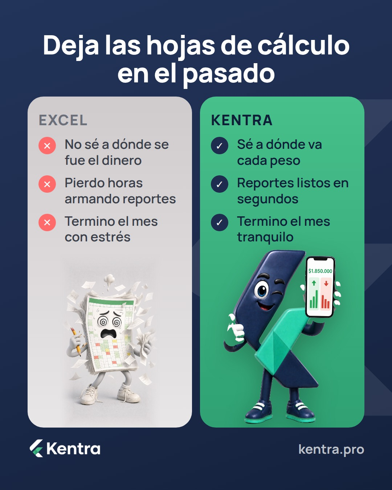
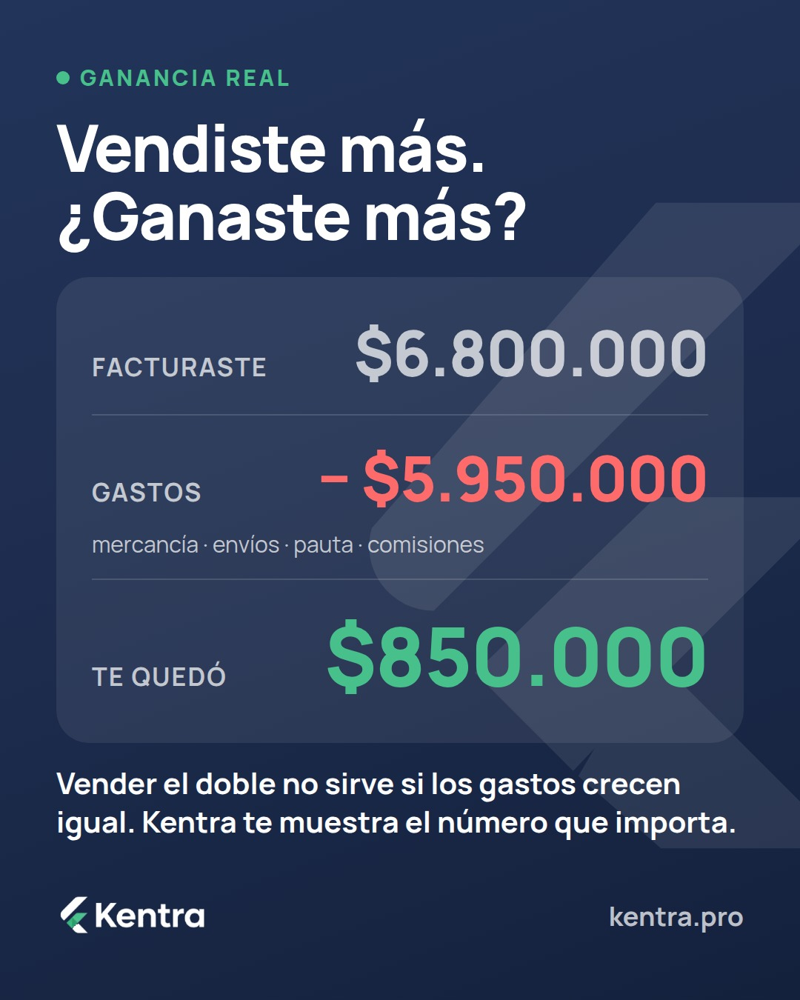
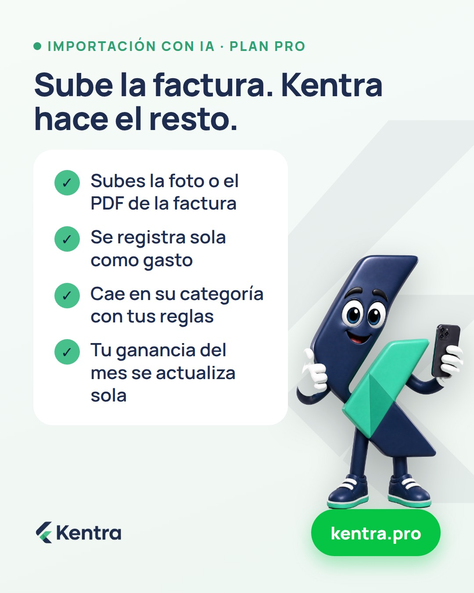
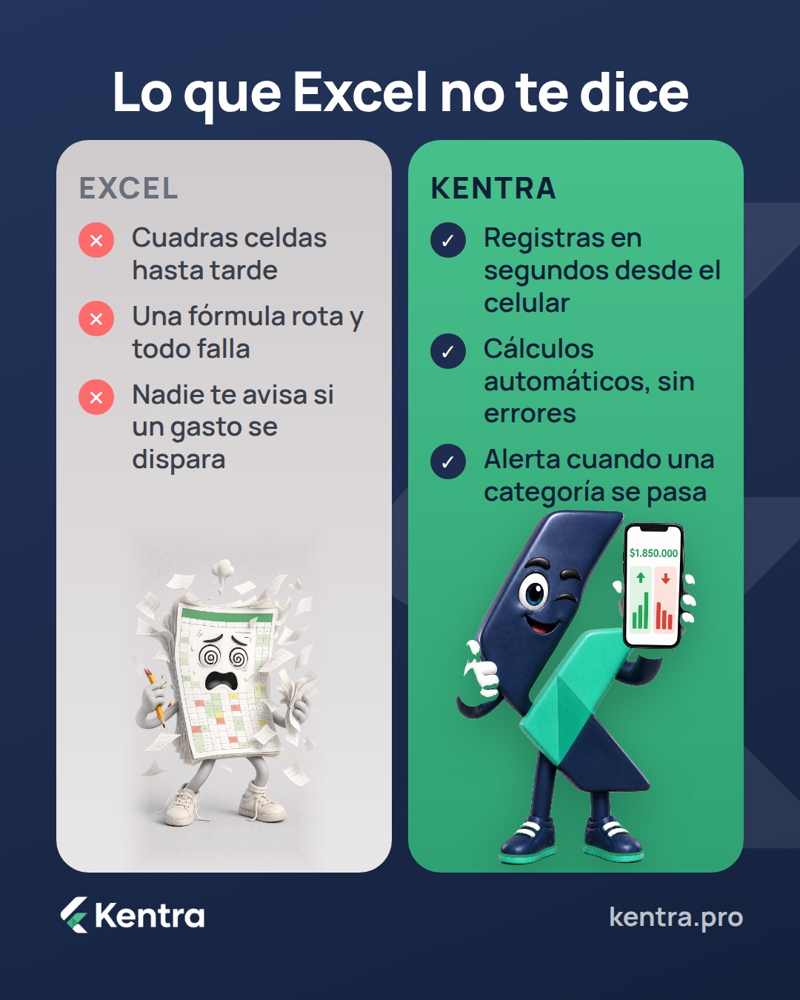

# Próximas publicaciones de Kentra

Se actualiza sola cada hora. Hora de Bogotá. 36 piezas agendadas.

## Miércoles 30/9

**08:00 — Historia** · ganancia-real · `2026-09-30-01-historia`

**12:00 — Post** · ganancia-real · `2026-09-30-02-post`

Descripción

Facturaste $12.500.000. ¿Y cuánto te quedó?

Entre proveedores, arriendo, nómina y comisiones se fueron $10.660.000. Te quedaron $1.840.000: ese es el número que importa, y casi nadie lo tiene claro a mitad de mes.

Kentra te muestra lo que entró, lo que salió y lo que te quedó, en una sola pantalla y sin Excel.

Desde $15/mes. 👉 [link de la bio en Instagram / link con UTM en Facebook]

#Kentra #FinanzasParaNegocios #Emprendedores #Pymes #NegocioPropio

**19:00 — Historia** · educacion · `2026-09-30-03-historia`

## Jueves 1/10

**08:00 — Historia** · funcionalidades · `2026-10-01-01-historia`

**12:00 — Carrusel** · educacion · `2026-10-01-02-carrusel`

     

Descripción

4 gastos que se comen tu ganancia sin que lo notes 👀

No son los grandes. Son los que nadie registra: la comisión de la pasarela, el domicilio que "absorbes", la cuota de la tarjeta y el sueldo que no te pagas.

Desliza y revisa cuántos te están pasando a ti.

Desde $15/mes. 👉 [link de la bio en Instagram / link con UTM en Facebook]

#Kentra #FinanzasParaNegocios #Emprendedores #Pymes #ControlDeGastos

**19:00 — Historia** · funcionalidades · `2026-10-01-03-historia`

## Viernes 2/10

**08:00 — Historia** · kentra-vs-excel · `2026-10-02-01-historia`

**12:00 — Post** · kentra-vs-excel · `2026-10-02-02-post`

Descripción

Excel no está mal. El problema es que depende de que tú lo mantengas al día.

Con Kentra registras cada movimiento en segundos, desde el celular, y el reporte del mes se arma solo: qué entró, qué salió y qué te quedó.

Menos horas cuadrando celdas, más claridad para decidir.

Desde $15/mes. 👉 [link de la bio en Instagram / link con UTM en Facebook]

#Kentra #FinanzasParaNegocios #Emprendedores #Excel #Pymes

**19:00 — Historia** · educacion · `2026-10-02-03-historia`

## Sábado 3/10

**08:00 — Historia** · objeciones · `2026-10-03-01-historia`

**12:00 — Post** · precio-valor · `2026-10-03-02-post`

Descripción

$15 al mes. Menos que un domicilio a la semana.

Con eso tienes tu dashboard, ingresos y gastos por categoría, comprobantes PDF con tu logo, alertas de deudas y KentrAI ilimitado.

Acceso inmediato, sin permanencia y cancelas cuando quieras desde tu cuenta.

👉 [link de la bio en Instagram / link con UTM en Facebook]

#Kentra #FinanzasParaNegocios #Emprendedores #Pymes #NegocioPropio

**19:00 — Historia** · objeciones · `2026-10-03-03-historia`

## Domingo 4/10

**08:00 — Historia** · verticales · `2026-10-04-01-historia`

**12:00 — Post** · ganancia-real · `2026-10-04-02-post`

Descripción

Vender mucho y no saber cuánto te queda es la forma más común de trabajar a ciegas.

Kentra pone tu ganancia real en una sola pantalla: lo que entró, lo que salió y lo que te quedó este mes. Sin fórmulas, sin Excel, desde el celular.

Desde $15/mes. 👉 [link de la bio en Instagram / link con UTM en Facebook]

#Kentra #FinanzasParaNegocios #Emprendedores #Pymes #Freelancer

**19:00 — Historia** · educacion · `2026-10-04-03-historia`

## Lunes 5/10

**08:00 — Historia** · ganancia-real · `2026-10-05-01-historia`

**12:00 — Post** · ganancia-real · `2026-10-05-02-post`

Descripción

Vender más no siempre es ganar más.

Una tienda online que factura $6.800.000 y gasta $5.950.000 entre mercancía, envíos, pauta y comisiones se queda con $850.000. Si las ventas suben pero los gastos suben igual, el número final no se mueve.

Kentra te muestra lo que entró, lo que salió y lo que te quedó, sin Excel.

Desde $15/mes. 👉 [link de la bio en Instagram / link con UTM en Facebook]

#Kentra #FinanzasParaNegocios #Emprendedores #TiendaOnline #Pymes

**19:00 — Historia** · objeciones · `2026-10-05-03-historia`

## Martes 6/10

**08:00 — Historia** · funcionalidades · `2026-10-06-01-historia`

**12:00 — Post** · funcionalidades · `2026-10-06-02-post`

Descripción

Digitar facturas una por una es trabajo que ya no tienes que hacer.

En el plan Pro subes la factura o el extracto del banco y Kentra registra los movimientos solos, cada uno en su categoría según las reglas que definas. Menos digitación, más claridad sobre lo que realmente gastas.

👉 [link de la bio en Instagram / link con UTM en Facebook]

#Kentra #FinanzasParaNegocios #Emprendedores #Pymes #NegocioPropio

**19:00 — Historia** · educacion · `2026-10-06-03-historia`

## Miércoles 7/10

**08:00 — Historia** · kentra-vs-excel · `2026-10-07-01-historia`

**12:00 — Post** · kentra-vs-excel · `2026-10-07-02-post`

Descripción

Excel calcula lo que le pides. Kentra te avisa lo que no viste.

Una fórmula rota, una celda que nadie actualizó, un gasto que se disparó sin que te dieras cuenta: eso no aparece en la hoja hasta que ya es tarde.

Con Kentra registras desde el celular, los cálculos son automáticos y te llega una alerta cuando una categoría se pasa.

Desde $15/mes. 👉 [link de la bio en Instagram / link con UTM en Facebook]

#Kentra #FinanzasParaNegocios #Emprendedores #Excel #Pymes

**19:00 — Historia** · funcionalidades · `2026-10-07-03-historia`

## Jueves 8/10

**08:00 — Historia** · educacion · `2026-10-08-01-historia`

**12:00 — Carrusel** · educacion · `2026-10-08-02-carrusel`

     

Descripción

4 señales de que tu negocio gana menos de lo que crees 👀

Ninguna aparece en las ventas. Todas aparecen en la ganancia: el saldo que sube junto con las deudas, la venta de hoy que paga la compra de ayer, el costo por venta que nadie suma y el sueldo que te pagas «con lo que sobra».

Desliza y cuenta cuántas te pasan.

Desde $15/mes. 👉 [link de la bio en Instagram / link con UTM en Facebook]

#Kentra #FinanzasParaNegocios #Emprendedores #Pymes #NegocioPropio

**19:00 — Historia** · verticales · `2026-10-08-03-historia`

## Viernes 9/10

**08:00 — Historia** · precio-valor · `2026-10-09-01-historia`

**12:00 — Post** · precio-valor · `2026-10-09-02-post`

Descripción

$20 al mes: el plan que más eligen quienes ya usan Kentra.

Todo lo del plan Básico (dashboard, ingresos y gastos por categoría, comprobantes PDF con tu logo, KentrAI ilimitado) más importación de extractos y facturas con IA, reglas de categorización automática, créditos y cuotas, inventario y hasta 2 negocios con 1 usuario extra.

Acceso inmediato, sin permanencia. Y si prefieres empezar más ligero, el Básico está desde $15/mes.

👉 [link de la bio en Instagram / link con UTM en Facebook]

#Kentra #FinanzasParaNegocios #Emprendedores #Pymes #NegocioPropio

**19:00 — Historia** · funcionalidades · `2026-10-09-03-historia`

## Sábado 10/10

**08:00 — Historia** · ganancia-real · `2026-10-10-01-historia`

**12:00 — Post** · objeciones · `2026-10-10-02-post`

Descripción

«Yo lo llevo todo en la cabeza.» Hasta que alguien pregunta cuánto te quedó el mes pasado.

La memoria es buena para vender, no para sumar 200 movimientos al mes. Kentra los guarda por ti, los ordena por categoría y te dice cuánto te quedó, sin que tengas que recordar nada.

Desde $15/mes. 👉 [link de la bio en Instagram / link con UTM en Facebook]

#Kentra #FinanzasParaNegocios #Emprendedores #NegocioPropio #Pymes

**19:00 — Historia** · educacion · `2026-10-10-03-historia`

## Domingo 11/10

**08:00 — Historia** · verticales · `2026-10-11-01-historia`

**12:00 — Post** · ganancia-real · `2026-10-11-02-post`

Descripción

Vender es la mitad del mes. La otra mitad es saber cuánto te quedó.

Muchos negocios cierran el mes con la sensación de que fue bueno, sin un número que lo confirme. Kentra te lo da: lo que entró, lo que salió y lo que te quedó, en una sola pantalla.

Desde $15/mes. 👉 [link de la bio en Instagram / link con UTM en Facebook]

#Kentra #FinanzasParaNegocios #Emprendedores #Pymes #NegocioPropio

**19:00 — Historia** · objeciones · `2026-10-11-03-historia`

