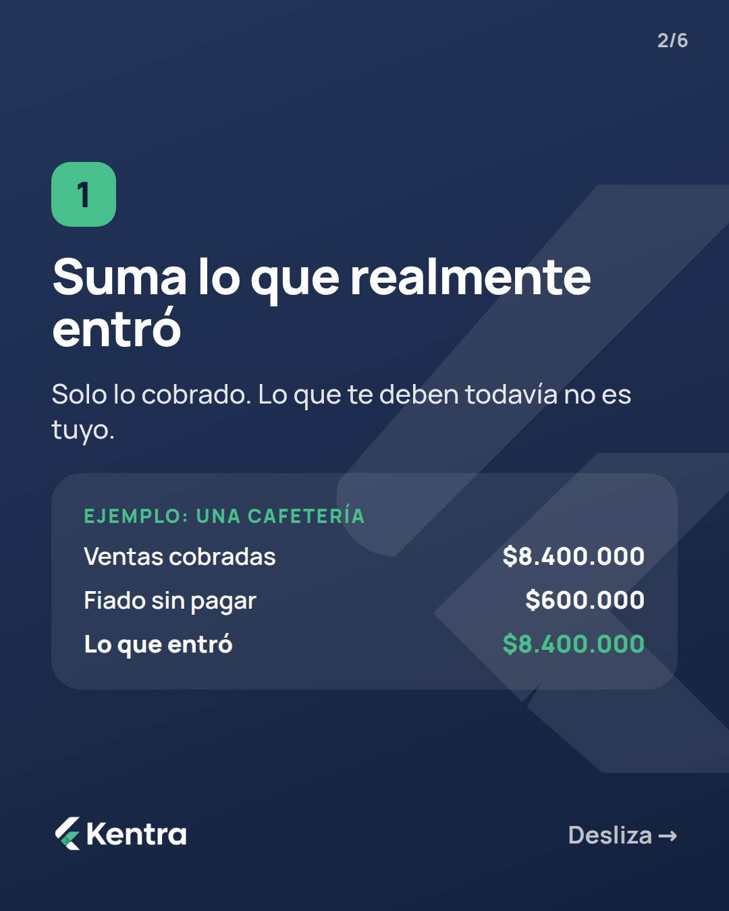
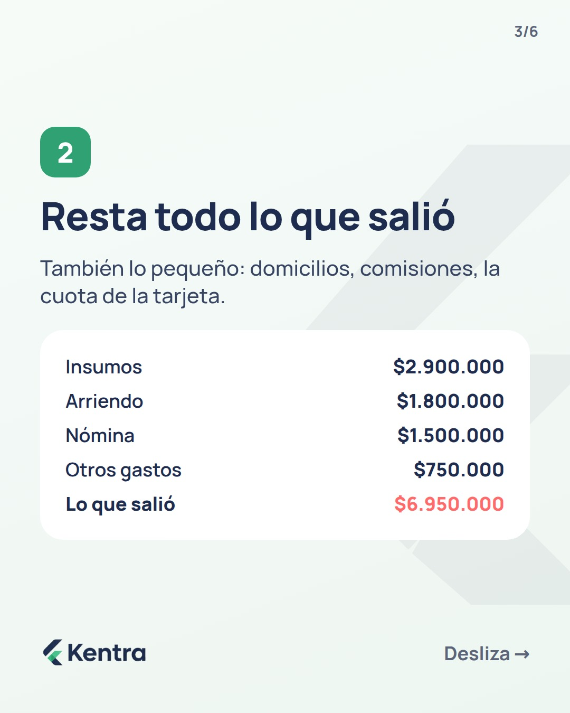
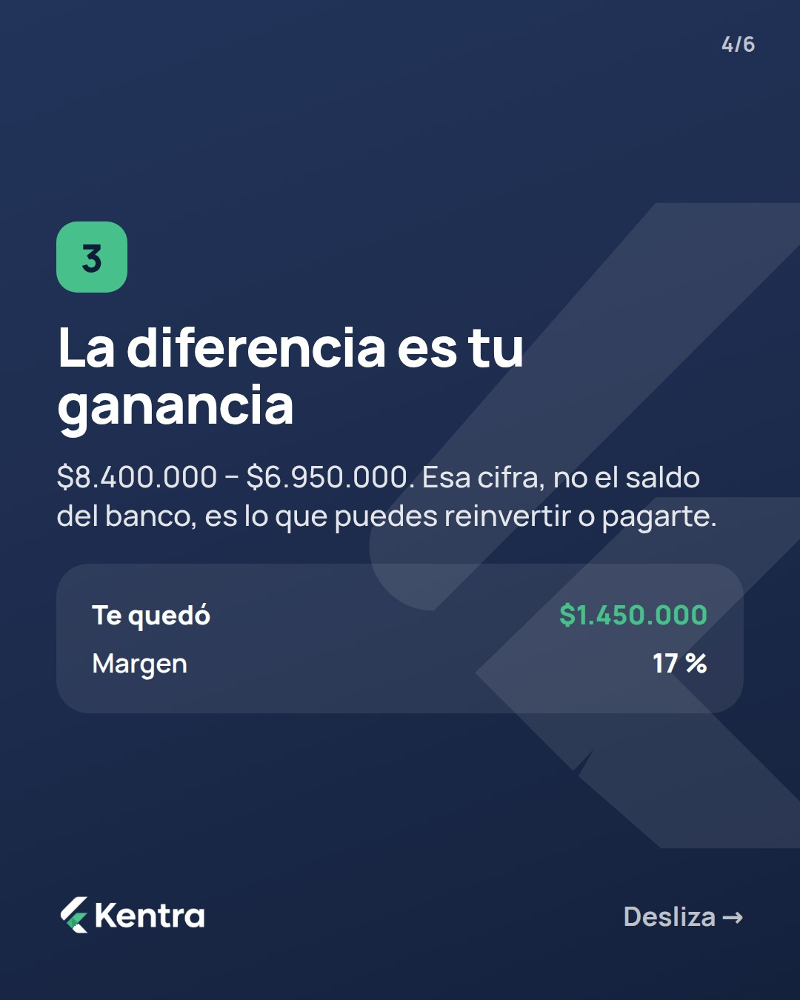
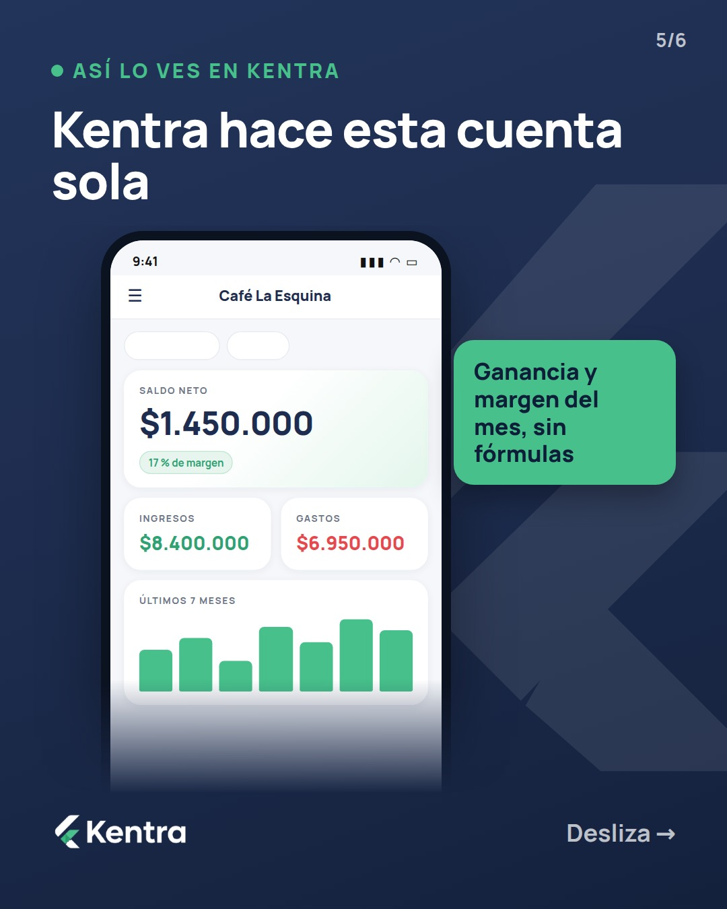

# Próximas publicaciones de Kentra

Se actualiza sola cada hora. Hora de Bogotá. 36 piezas agendadas.

## Miércoles 30/9

**08:00 — Historia** · ganancia-real · `2026-09-30-01-historia`

**12:00 — Carrusel** · ganancia-real · `2026-09-30-02-carrusel`

     

Descripción

La mayoría sabe cuánto vendió. Muy pocos saben cuánto les quedó.

En este carrusel: los 3 pasos para calcular tu ganancia real, con el ejemplo de una cafetería que vendió $8.400.000 y le quedaron $1.450.000 (17 % de margen). Guárdalo para tu próximo cierre de mes.

Si no quieres hacer la cuenta a mano, Kentra la hace sola. 👉 [link de la bio en Instagram / link con UTM en Facebook]

#Kentra #FinanzasParaNegocios #Emprendedores #Pymes #GananciaReal

**19:00 — Historia** · educacion · `2026-09-30-03-historia`

## Jueves 1/10

**08:00 — Historia** · funcionalidades · `2026-10-01-01-historia`

**12:00 — Carrusel** · educacion · `2026-10-01-02-carrusel`

     

Descripción

4 gastos que se comen tu ganancia sin que lo notes 👀

No son los grandes. Son los que nadie registra: la comisión de la pasarela, el domicilio que "absorbes", la cuota de la tarjeta y el sueldo que no te pagas.

Desliza y revisa cuántos te están pasando a ti.

Desde $15/mes. 👉 [link de la bio en Instagram / link con UTM en Facebook]

#Kentra #FinanzasParaNegocios #Emprendedores #Pymes #ControlDeGastos

**19:00 — Historia** · funcionalidades · `2026-10-01-03-historia`

## Viernes 2/10

**08:00 — Historia** · kentra-vs-excel · `2026-10-02-01-historia`

**12:00 — Carrusel** · educacion · `2026-10-02-02-carrusel`

      

Descripción

5 errores de dinero muy comunes en negocios pequeños (y cómo corregir cada uno).

Desde mezclar tu plata con la del negocio hasta no tener colchón para un mes flojo. Desliza, revisa cuántos te pasan y guárdalo.

Kentra te ayuda a corregirlos sin hojas de cálculo. 👉 [link de la bio en Instagram / link con UTM en Facebook]

#Kentra #FinanzasParaNegocios #Emprendedores #Pymes #NegocioPropio

**19:00 — Historia** · educacion · `2026-10-02-03-historia`

## Sábado 3/10

**08:00 — Historia** · objeciones · `2026-10-03-01-historia`

**12:00 — Carrusel** · educacion · `2026-10-03-02-carrusel`

      

Descripción

¿Tu precio cubre todo lo que cuesta producir, o solo los ingredientes?

En este carrusel: el método en 4 pasos para ponerle precio a lo que vendes, con el ejemplo de una torta. Costo directo $27.500 + fijos $15.000 + ganancia = precio mínimo de $55.250. Guárdalo y haz la cuenta con tu producto.

Kentra te muestra cuando un costo sube para que ajustes a tiempo. 👉 [link de la bio en Instagram / link con UTM en Facebook]

#Kentra #FinanzasParaNegocios #Emprendedores #Precios #Emprendimiento

**19:00 — Historia** · objeciones · `2026-10-03-03-historia`

## Domingo 4/10

**08:00 — Historia** · verticales · `2026-10-04-01-historia`

**12:00 — Carrusel** · educacion · `2026-10-04-02-carrusel`

      

Descripción

Si toda la plata del negocio está en un solo lugar, se va en todo y en nada.

En este carrusel: los 4 bolsillos para ordenar el dinero de tu negocio (operación, impuestos, tu sueldo y reserva) y en qué orden llenarlos.

Kentra te muestra cuánto te quedó cada mes para repartirlo con cabeza. 👉 [link de la bio en Instagram / link con UTM en Facebook]

#Kentra #FinanzasParaNegocios #Emprendedores #OrdenFinanciero #Pymes

**19:00 — Historia** · educacion · `2026-10-04-03-historia`

## Lunes 5/10

**08:00 — Historia** · ganancia-real · `2026-10-05-01-historia`

**12:00 — Carrusel** · ganancia-real · `2026-10-05-02-carrusel`

     

Descripción

Ver $3.200.000 en el banco se siente bien. Hasta que restas lo que ya debes.

En este carrusel: la diferencia entre flujo de caja y ganancia, con un ejemplo donde el saldo parece bueno pero el mes cierra en −$180.000.

Kentra te muestra lo que tienes, lo que debes y lo que te quedó. 👉 [link de la bio en Instagram / link con UTM en Facebook]

#Kentra #FinanzasParaNegocios #Emprendedores #FlujoDeCaja #Pymes

**19:00 — Historia** · objeciones · `2026-10-05-03-historia`

## Martes 6/10

**08:00 — Historia** · funcionalidades · `2026-10-06-01-historia`

**12:00 — Carrusel** · funcionalidades · `2026-10-06-02-carrusel`

      

Descripción

¿Cómo se ve Kentra por dentro? Así.

1. Tu mes completo en una pantalla. 2. Subes el extracto y los movimientos se registran solos (plan Pro). 3. Comprobantes PDF con tu logo. 4. Alertas antes de que algo venza. 5. KentrAI responde con tus propios números.

Desde $15/mes. 👉 [link de la bio en Instagram / link con UTM en Facebook]

#Kentra #FinanzasParaNegocios #Emprendedores #Pymes #Productividad

**19:00 — Historia** · educacion · `2026-10-06-03-historia`

## Miércoles 7/10

**08:00 — Historia** · kentra-vs-excel · `2026-10-07-01-historia`

**12:00 — Carrusel** · educacion · `2026-10-07-02-carrusel`

      

Descripción

El dinero que te deben no te sirve hasta que llega.

En este carrusel: 4 hábitos simples para cobrar a tiempo. Fecha de pago clara, comprobante profesional, recordatorio un día antes y registro de quién te debe.

En Kentra marcas una cuenta como cobrada y queda registrada sola. 👉 [link de la bio en Instagram / link con UTM en Facebook]

#Kentra #FinanzasParaNegocios #Emprendedores #Cobranza #Emprendedores

**19:00 — Historia** · funcionalidades · `2026-10-07-03-historia`

## Jueves 8/10

**08:00 — Historia** · educacion · `2026-10-08-01-historia`

**12:00 — Carrusel** · educacion · `2026-10-08-02-carrusel`

     

Descripción

4 señales de que tu negocio gana menos de lo que crees 👀

Ninguna aparece en las ventas. Todas aparecen en la ganancia: el saldo que sube junto con las deudas, la venta de hoy que paga la compra de ayer, el costo por venta que nadie suma y el sueldo que te pagas «con lo que sobra».

Desliza y cuenta cuántas te pasan.

Desde $15/mes. 👉 [link de la bio en Instagram / link con UTM en Facebook]

#Kentra #FinanzasParaNegocios #Emprendedores #Pymes #NegocioPropio

**19:00 — Historia** · verticales · `2026-10-08-03-historia`

## Viernes 9/10

**08:00 — Historia** · precio-valor · `2026-10-09-01-historia`

**12:00 — Carrusel** · educacion · `2026-10-09-02-carrusel`

        

Descripción

No son los gastos grandes los que se comen la ganancia. Son los pequeños que nadie anota.

En este carrusel: 6 gastos hormiga del negocio, desde comisiones de pago hasta las compras en efectivo sin recibo. Solo las comisiones de $6.000.000 en ventas ya son $180.000 al mes.

Kentra te avisa cuando una categoría se pasa. 👉 [link de la bio en Instagram / link con UTM en Facebook]

#Kentra #FinanzasParaNegocios #Emprendedores #GastosHormiga #Pymes

**19:00 — Historia** · funcionalidades · `2026-10-09-03-historia`

## Sábado 10/10

**08:00 — Historia** · ganancia-real · `2026-10-10-01-historia`

**12:00 — Carrusel** · educacion · `2026-10-10-02-carrusel`

       

Descripción

Guarda este checklist para el cierre de mes.

5 pasos en 15 minutos: registrar lo que falte, revisar lo que te deben, revisar lo que debes, mirar tus 3 números y comparar con el mes anterior.

En Kentra el cierre se hace en 3 minutos porque ya está todo registrado. 👉 [link de la bio en Instagram / link con UTM en Facebook]

#Kentra #FinanzasParaNegocios #Emprendedores #CierreDeMes #Pymes

**19:00 — Historia** · educacion · `2026-10-10-03-historia`

## Domingo 11/10

**08:00 — Historia** · verticales · `2026-10-11-01-historia`

**12:00 — Carrusel** · ganancia-real · `2026-10-11-02-carrusel`

     

Descripción

Pagarte muy poco te quema. Pagarte demasiado ahoga al negocio.

En este carrusel: cómo calcular un sueldo sostenible con tu ganancia promedio de los últimos 3 meses y una reserva del 30 %. En el ejemplo: $1.400.000 de promedio → $980.000 de sueldo.

KentraI te hace la cuenta con tus propios números. 👉 [link de la bio en Instagram / link con UTM en Facebook]

#Kentra #FinanzasParaNegocios #Emprendedores #SueldoEmprendedor #Pymes

**19:00 — Historia** · objeciones · `2026-10-11-03-historia`

